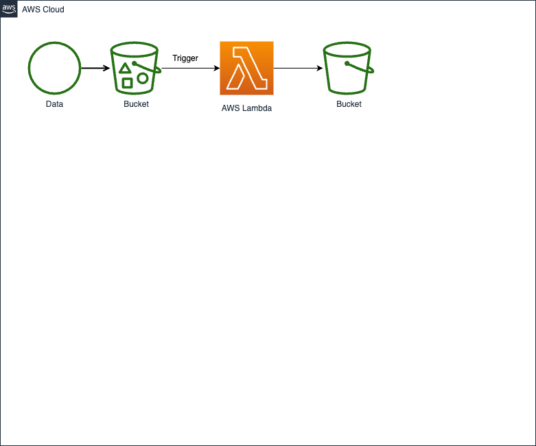

# Lemmatization and Wordform Frequency Extraction

This Python script is designed to process a JSON file containing parsed sentences and extract lemma frequency and wordform frequency information. The processed data is then saved to a JSON file. The code is written in compliance with PEP 8 guidelines and includes type hints for better readability and understanding.

## Prerequisites

Before using the code, ensure you have the following requirements in place:

- Python 3.x
- Pydantic (Python library)
- Sample parsed sentences JSON file (e.g., `sample_parsed_sentences.json`) in the data directory.

## How to Use

1. Install Pydantic if you haven't already.

2. Place your sample parsed sentences JSON file (`sample_parsed_sentences.json`) in the data directory, or specify the path to your JSON file in the code instead of loading it from disk.

3. Run the Python script: python3 main.py

4. The script will process the input data and display the output on the console.

5. The processed data will be saved as a JSON file named `output.json` in the data directory.

## Input Data Format

The script expects input data in the following JSON format:

```json
{
 "sentences": [
     {
         "sentence_text": "Example sentence text",
         "tokens": [
             {
                 "id": "1",
                 "text": "word",
                 "lemma": "lemma",
                 "pos": "NOUN",
                 "pos_finegrained": "fine-grained",
                 "feats": "Feats",
                 "start_char": "0",
                 "end_char": "4"
             },
             ...
         ]
     },
     ...
 ]
}
```
Make sure to adapt your input data to this format.

Output Data
The script will generate an output JSON file (output.json) containing lemma frequency and wordform frequency information.


License
This project is licensed under the MIT License. Feel free to modify and use the code for your own projects.


# Deployment

This functionality can be deployed as a lambda function which listens to input data file being uploaded in an S3 bucket which triggers the lambda function. The lambda function contains the main.py code.

After the input processing, the lambda function saves the output json file back in S3 bucket.

A simple architecture diagram explains this:

  

